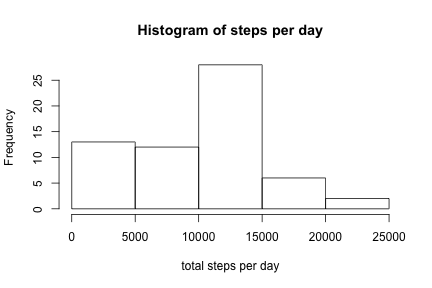
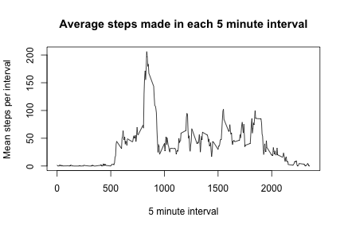
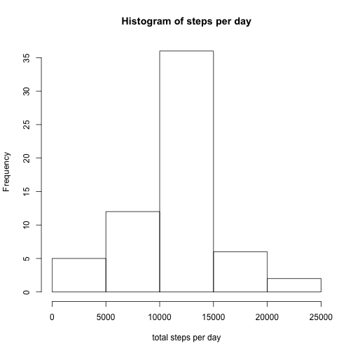
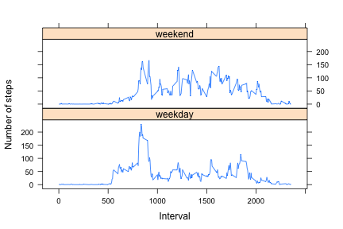

This is my solution to Course Project 1 of the Reproducible Research Module described
at https://www.coursera.org/learn/reproducible-research/peer/gYyPt/course-project-1

- **Loading and preprocessing the data**


```r
echo=TRUE
activity<-read.csv("activity.csv")
names(activity)
```

```
## [1] "steps"    "date"     "interval"
```

```r
#note that missing values are coded as NA
head(activity)
```

```
##   steps       date interval
## 1    NA 2012-10-01        0
## 2    NA 2012-10-01        5
## 3    NA 2012-10-01       10
## 4    NA 2012-10-01       15
## 5    NA 2012-10-01       20
## 6    NA 2012-10-01       25
```
- **What is mean total number of steps taken per day?**

```r
## Mean total number of steps per day. Ignore missing values.
echo=TRUE
steps_per_day<-tapply(activity$steps,activity$date,sum,na.rm=T)
hist(steps_per_day,xlab="total steps per day",main="Histogram of steps per day")
```



```r
echo = TRUE
# Median and mean number of steps per day
median_steps<-median(steps_per_day)
mean_steps<-mean(steps_per_day)
c(median_steps,mean_steps)
```

```
## [1] 10395.00  9354.23
```

- **What is the average daily activity pattern?**

```r
echo=TRUE
mean_steps_per_interval<-tapply(activity$steps,activity$interval,mean,na.rm=T)
df_activity<-data.frame(interval=unique(activity$interval),steps=mean_steps_per_interval)
plot(df_activity,type="l",xlab="5 minute interval",ylab="Mean steps per interval",main="Average steps made in each 5 minute interval")
```



Which 5-minute interval, on average across all the days in the dataset, contains the maximum number of steps?

```r
echo=TRUE
mean_steps_per_interval[which.max(mean_steps_per_interval)]
```

```
##      835 
## 206.1698
```

- **Imputing missing values**
Strategry: Create a function which will go through the values when it gets to a NA value then use the mean number of steps for the corresponding interval


```r
# Calculate and report the total number of missing values in the dataset (i.e. the total number of rows with NAs)
echo=TRUE
sum(is.na(activity$steps))
```

```
## [1] 2304
```

```r
# Fill in the missing data
activity_new<-activity
for(i in 1:nrow(activity)){
  if(is.na(activity$steps[i])){
    replace_index<-activity$interval[i]
    activity_new$steps[i]=mean_steps_per_interval[[as.character(replace_index)]]
  }
}
```


```r
echo = TRUE
# Now for the histogram of total steps per day
steps_per_day_new<-tapply(activity_new$steps,activity_new$date,sum,na.rm=T)
hist(steps_per_day_new,xlab="total steps per day",main="Histogram of steps per day")
```



```r
# Mean and median
median_steps_new<-median(steps_per_day_new)
mean_steps_new<-mean(steps_per_day_new)
c(median_steps,median_steps_new)
```

```
## [1] 10395.00 10766.19
```

```r
c(mean_steps,mean_steps_new)
```

```
## [1]  9354.23 10766.19
```
Impact of imputing missing data on estimates of the total daily number of steps

```r
echo = TRUE
summary(activity)
```

```
##      steps                date          interval     
##  Min.   :  0.00   2012-10-01:  288   Min.   :   0.0  
##  1st Qu.:  0.00   2012-10-02:  288   1st Qu.: 588.8  
##  Median :  0.00   2012-10-03:  288   Median :1177.5  
##  Mean   : 37.38   2012-10-04:  288   Mean   :1177.5  
##  3rd Qu.: 12.00   2012-10-05:  288   3rd Qu.:1766.2  
##  Max.   :806.00   2012-10-06:  288   Max.   :2355.0  
##  NA's   :2304     (Other)   :15840
```

```r
summary(activity_new)
```

```
##      steps                date          interval     
##  Min.   :  0.00   2012-10-01:  288   Min.   :   0.0  
##  1st Qu.:  0.00   2012-10-02:  288   1st Qu.: 588.8  
##  Median :  0.00   2012-10-03:  288   Median :1177.5  
##  Mean   : 37.38   2012-10-04:  288   Mean   :1177.5  
##  3rd Qu.: 27.00   2012-10-05:  288   3rd Qu.:1766.2  
##  Max.   :806.00   2012-10-06:  288   Max.   :2355.0  
##                   (Other)   :15840
```
Conclusion: properties look the same aside from the fact that in activity_new there are no NA values.

- **Are there differences in activity patterns between weekdays and weekends?**

I've two approaches and I'll list them both below.

    - Approach 1: Create variable according to weekday/weekend. Then filter/subset the data. Use the subsetted data to get the mean number of steps for the weekday/weekend. Combine them in a dataframe and make the plot separated by category of weekday/weekend.

```r
echo=TRUE
activity_new$weekday_end<-c("weekday")
activity_new[weekdays(as.Date(activity_new$date)) %in% c("Saturday","Sunday"),]$weekday_end<-c("weekend")
activity_new$weekday_end<-factor(activity_new$weekday)
table(activity_new$weekday_end)
```

```
## 
## weekday weekend 
##   12960    4608
```

```r
activity_new_weekday<-subset(activity_new,weekday_end=="weekday")
activity_new_weekend<-subset(activity_new,weekday_end=="weekend")
meansteps_weekday<- tapply(activity_new_weekday$steps,activity_new_weekday$interval,mean)
meansteps_weekend<- tapply(activity_new_weekend$steps,activity_new_weekend$interval,mean)
df_activity_weekday<-data.frame(interval=unique(activity_new_weekday$interval),avgsteps=meansteps_weekday,weekday_end="weekday")
df_activity_weekend<-data.frame(interval=unique(activity_new_weekend$interval),avgsteps=meansteps_weekend,weekday_end="weekend")
df_activity<-rbind(df_activity_weekday,df_activity_weekend)
library(lattice)
xyplot(avgsteps~interval | weekday_end, data=df_activity,layout=c(1,2),type="l",xlab="Interval",ylab="Number of steps")
```



    - Approach 2: Thought the above approach was a little cumbersome. A more elegant solution is to use the dplyr package.

```r
library (dplyr)
echo=TRUE
steps_per_interval_weekend<-activity_new %>% filter(weekday_end %in% c("weekend")) %>% group_by(interval) %>% summarise(avgsteps=mean(steps),weekday_end=factor("weekend"))
steps_per_interval_weekday<-activity_new %>% filter(weekday_end %in% c("weekday")) %>% group_by(interval) %>% summarise(avgsteps=mean(steps),weekday_end=factor("weekday"))
steps_per_interval<-rbind(steps_per_interval_weekend,steps_per_interval_weekday)
#xyplot(avgsteps~interval | weekday_end,layout=c(1,2),data=steps_per_interval,type="l",xlab="Interval",ylab="Number of steps")
```
